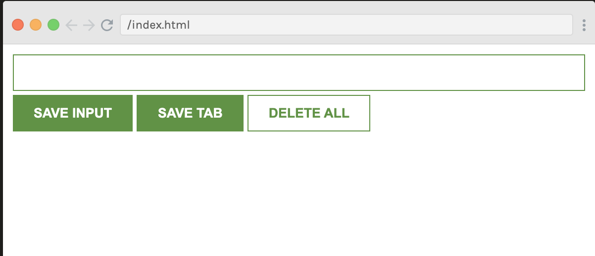

<h1 align="center">{Chrome Extension: save tabs and links}</h1>

   Solution for a challenge from Scrimba to develop a chrome extensions   <a href="http:www.scrimba.com" target="_blank">Scrimba</a>.

<!-- TABLE OF CONTENTS -->

## Overview

ß

For this challenge I developed a chrome extensions, where I would be able to save any links or useful tabs to view later.

## What I learnt

I learnt about web storage objects `localStorage` and `sessionStorage`, which allow to save key/value pairs in the browser. I have also practiced.	

## Continued development

- Improve the design of the webpage
- Add newer functionality to provide link previews similar to Raindrop.io
- Use ES6+ 